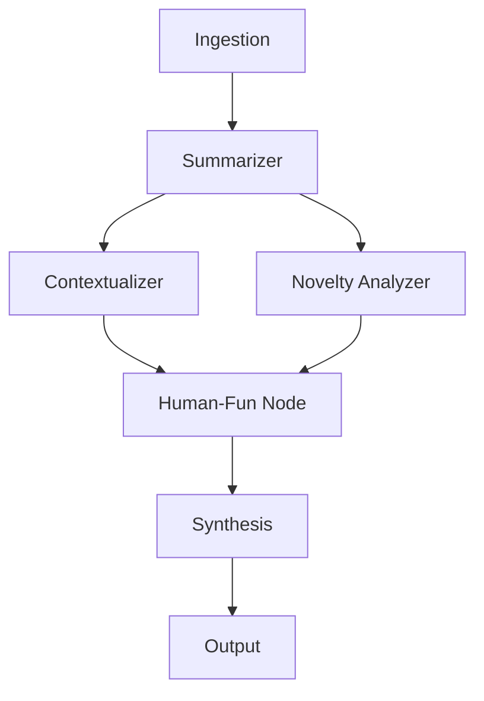

# LaughGraph: Serious + Human-Fun AI Research Digest


> Making AI research papers both educational and fun — because who says science can't make you smile? 😊

## 🎯 Core Purpose

To help researchers, students, and curious readers understand AI research papers quickly — with clear explanations and light, witty humor that makes the insights stick.

## 🚀 The Problem

AI research papers are often:
- Dense and difficult to understand
- Repetitive with similar approaches
- Over-hyped with minimal actual novelty
- Boring for general audiences

Readers either struggle to understand them or get bored halfway through.

## 💡 The Solution

A **LangGraph-powered assistant** that produces two synchronized perspectives for each paper:

- **Serious summary** → accurate, structured explanation
- **Human-fun version** → light humor, analogies, and emojis that make it relatable

## 🔗 Why LangGraph?

- **Branching**: Supports serious vs fun processing paths
- **Conditions**: If novelty is low → add playful "same recipe" analogies
- **Feedback loops**: Fun side can ask serious side for clarity
- **Workflow orchestration**: Complex multi-step processing with decision points

## 🧩 Workflow Nodes



### Node Details:

1. **Ingestion** → Fetch & parse papers (arXiv, PDFs)
2. **Summarizer** → Generate plain-language + technical summaries
3. **Contextualizer** → Explain how the paper fits in the field
4. **Novelty Analyzer** → Rate how new the idea actually is
5. **Human-Fun Node** → Add friendly humor:
   - "Impressive engineering!" 🔧
   - Light jokes about computational effort (e.g., "GPUs working overtime")
   - Analogies (e.g., "bigger pizza 🍕 = better model")
6. **Synthesis** → Merge serious + fun into one cohesive digest
7. **Output** → Generate blog posts, markdown, tweet threads, or meme-ready captions

## 🌟 Key Features

- **Dual Perspective**: "What the paper says" + "How it feels in human language"
- **Gentle Humor**: No harsh roasts — just witty analogies and light jokes
- **Conditional Fun**: Humor depth adapts (low novelty → more playful analogies)
- **Trend Tracking**: Identifies repeated themes ("yet another fine-tune") 
- **Accessible Digest**: Makes research both educational and entertaining

## 🆚 What's Unique?

Other tools either:
- Summarize papers seriously (boring) 📚
- Make jokes without structure (unhelpful) 🃏

**LaughGraph** = Structured research analysis + human-fun commentary in one conditional workflow.

> Think of it as a study guide that explains papers clearly while also making you smile! 😄

## 🛠️ Installation

### Prerequisites
- Python 3.8+
- uv (recommended) or pip

### Setup

```bash
# Clone the repository
git clone https://github.com/yourusername/laughgraph.git
cd laughgraph

# Install dependencies with uv
uv sync

# Or with pip
pip install -r requirements.txt

# Set up environment variables
cp .env.example .env
# Edit .env with your API keys (OpenAI, ArXiv, etc.)
```

### Environment Variables

```bash
OPENAI_API_KEY=your_openai_key
ARXIV_API_BASE=http://export.arxiv.org/api/query
CHROMA_PERSIST_DIR=./db/chroma_store
```

## 🚀 Quick Start

```python
from arxiv_docs import ArxivAPI
from langraph_pipeline import LaughGraphPipeline

# Initialize the pipeline
pipeline = LaughGraphPipeline()

# Process a paper from ArXiv ID
result = pipeline.process_paper("2312.12345")

print("Serious Summary:")
print(result.serious_summary)

print("\nFun Version:")
print(result.fun_summary)
```

## 📁 Project Structure

```
paper_sum/
├── arxiv_docs/           # ArXiv API and PDF processing
│   ├── arxiv_api.py     # Fetch papers from ArXiv
│   └── clean_pdfs.py    # PDF parsing and chunking
├── db/                  # Vector database storage
│   └── chroma_store/    # Chroma embeddings
├── research_papers/     # Downloaded PDFs and extracted text
├── langraph_nodes/      # LangGraph workflow nodes
├── main.py             # Main application entry point
├── pyproject.toml      # Project dependencies
└── README.md           # This file
```

## 🔄 Workflow Examples

### Processing Pipeline

1. **Input**: ArXiv paper ID or PDF file
2. **Extraction**: Parse content and create chunks
3. **Analysis**: Generate serious technical summary
4. **Fun Generation**: Add humor and analogies
5. **Output**: Combined digest with both perspectives

### Sample Output

**Paper**: "Attention Is All You Need"

**Serious**: "The paper introduces the Transformer architecture, replacing recurrent layers with self-attention mechanisms for sequence-to-sequence tasks..."

**Fun**: "The authors basically said 'Who needs memory when you have really good focus?' and created a model that pays attention to everything at once. It's like having ADHD but in a productive way! 🧠✨"

## 🤝 Contributing

We welcome contributions! Please see our [Contributing Guidelines](CONTRIBUTING.md) for details.

### Development Setup

```bash
# Install development dependencies
uv sync --dev

# Run tests
pytest

# Format code
black .
isort .

# Type checking
mypy .
```

## 📊 Roadmap

- [ ] **v1.0**: Basic ArXiv processing with dual summaries
- [ ] **v1.1**: Web interface for interactive paper exploration
- [ ] **v1.2**: Social media thread generation
- [ ] **v2.0**: Multi-language support
- [ ] **v2.1**: Audio summaries with different tones
- [ ] **v3.0**: Real-time paper trend analysis

## 📝 License

This project is licensed under the MIT License - see the [LICENSE](LICENSE) file for details.

## 🙏 Acknowledgments

- **LangGraph** team for the amazing workflow framework
- **ArXiv** for providing open access to research papers
- **Chroma** for vector database capabilities
- The research community for creating papers worth summarizing (and gently joking about)

## 📞 Contact

- **Issues**: [GitHub Issues](https://github.com/yourusername/laughgraph/issues)
- **Discussions**: [GitHub Discussions](https://github.com/yourusername/laughgraph/discussions)
- **Email**: your.email@example.com

---

*"Making AI research accessible, one laugh at a time!"* 😄🔬
